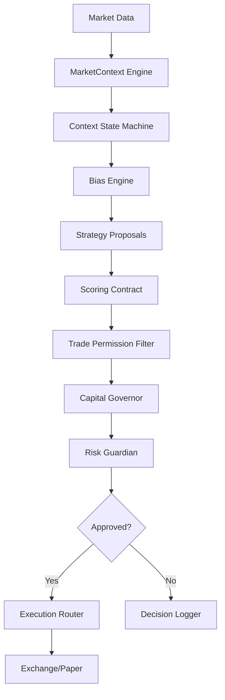

# CryptoBoss v11.0-FINAL Architecture

> **Philosophy**: Survival first, profit second, explainability always.

---

## System Overview

CryptoBoss is a personal-live-ready crypto trading platform designed with **operator safety** as the primary concern. It implements a strict decision pipeline where every trade must pass through multiple safety gates before execution.



---

## Core Principles

| Principle | Implementation |
|-----------|---------------|
| No forced trades | Strategies propose, engine decides |
| Risk veto overrides all | `RiskGuardian` has final say |
| Human accountability | `OperatorDiscipline` with audit log |
| Explainability always | `DecisionNarrative` for every choice |
| Fail safe | `IncidentStateMachine` with FREEZE state |

---

## Environment Model

| Mode | Base URL | Data Tag |
|------|----------|----------|
| `LIVE` | `api.binance.com` | `LIVE_EXCHANGE` |
| `TESTNET` | `testnet.binance.vision` | `TESTNET_EXCHANGE` |
| `PAPER` | N/A (simulated) | `SIMULATED` |

**Rules**:
- Environment set at startup only (immutable)
- Every API response includes `environment_signature`
- Frontend blocks mixed-environment rendering
- LIVE mode UI is visually distinct (red banner)

**Implementation**: [environment_guard.py](file:///d:/projects/final99/src/core/environment_guard.py)

---

## Decision Pipeline (8 Stages)

| # | Stage | Module | Veto Power |
|---|-------|--------|------------|
| 1 | Market Context | `market_context_engine.py` | ✅ `NO_TRADE` blocks all |
| 2 | Context State | `context_state_machine.py` | ✅ State transitions |
| 3 | Bias Engine | `bias_engine.py` | ✅ Anti-bias trades blocked |
| 4 | Strategy Proposals | `strategies/*.py` | ❌ Propose only |
| 5 | Scoring Contract | `scoring_contract.py` | ✅ Invalid proposals rejected |
| 6 | Permission Filter | `trade_permission_filter.py` | ✅ Final gate check |
| 7 | Capital Governor | `capital_governor.py` | ✅ Size reduction/veto |
| 8 | Risk Guardian | `risk_guardian.py` | ✅ **Kill switch** |

**Non-negotiable**: No step can be skipped. Any veto stops the pipeline.

---

## Scoring Contract

All strategy proposals must include 4 mandatory components:

| Component | Weight | Description |
|-----------|--------|-------------|
| `context_fit` | 30% | How well proposal matches market context |
| `historical_expectancy` | 25% | Historical win rate and R:R |
| `recent_performance_decay` | 25% | Time-weighted recent results |
| `risk_alignment` | 20% | Compliance with risk rules |

**Implementation**: [scoring_contract.py](file:///d:/projects/final99/src/core/scoring_contract.py)

---

## Capital Allocation

| Context | Base Allocation | Effect |
|---------|-----------------|--------|
| `TRENDING` | 100% | Full capital available |
| `RANGING` | 75% | Reduced exposure |
| `HIGH_VOLATILITY` | 30% | Defensive mode |
| `NO_TRADE` | 0% | No trading |

**Modifiers**: Volatility, drawdown level, exchange health, bias confidence

**Implementation**: [capital_governor.py](file:///d:/projects/final99/src/core/capital_governor.py)

---

## Risk Guardian

Controls that **cannot be bypassed**:

| Control | Description |
|---------|-------------|
| `max_daily_drawdown` | Daily loss limit |
| `max_exposure` | Maximum position value |
| `max_consecutive_losses` | Circuit breaker |
| `kill_switch` | Emergency halt (persists across restarts) |

**Implementation**: [risk_guardian.py](file:///d:/projects/final99/src/core/risk_guardian.py)

---

## Incident Management

| State | Description | Trading |
|-------|-------------|---------|
| `NORMAL` | All systems operational | Full |
| `DEGRADED` | Minor issues detected | Reduced |
| `INCIDENT_FREEZE` | Significant problem | Reduce-only |
| `HALTED` | Critical failure | None |

**Rules**:
- Exit from FREEZE/HALTED requires operator acknowledgment
- Incident reason is always logged
- Positions can only be reduced in FREEZE

**Implementation**: [incident_state_machine.py](file:///d:/projects/final99/src/core/incident_state_machine.py)

---

## Data Authenticity

| Tag | Meaning |
|-----|---------|
| `LIVE_EXCHANGE` | Real-time exchange data |
| `TESTNET_EXCHANGE` | Testnet exchange data |
| `DERIVED` | Calculated from live data |
| `SIMULATED` | Paper trading/backtest |
| `STALE` | Data older than threshold |

**Rules**:
- Every numeric value carries a data tag
- STALE data triggers warning state
- Mixed sources forbidden in UI

**Implementation**: [data_authenticity.py](file:///d:/projects/final99/src/core/data_authenticity.py)

---

## Operator Control

| Action | Requires Reason | Audited |
|--------|-----------------|---------|
| `pause_trading` | ✅ | ✅ |
| `resume_trading` | ✅ | ✅ |
| `acknowledge_incident` | ✅ | ✅ |

**Constraint**: Operator cannot bypass risk or capital veto.

**Implementation**: [operator_discipline.py](file:///d:/projects/final99/src/core/operator_discipline.py)

---

## Frontend Requirements

| Panel | Purpose |
|-------|---------|
| Environment Banner | LIVE/TESTNET/PAPER visibility |
| Why No Trade | Explains blocked trades |
| Decision Gate Breakdown | Pipeline visualization |
| Incident Timeline | State change history |
| Operator Actions Log | Audit trail |
| Startup Progress | Cold start visibility |

---

## Explicit Non-Goals

❌ No AI-generated trade execution  
❌ No auto-optimization  
❌ No strategy overfitting  
❌ No prediction-driven trading

---

## File Structure

```
src/core/
├── environment_guard.py     # v10.4 Environment truth
├── data_authenticity.py     # v10.4 Data tagging
├── decision_narrative.py    # v10.4 Explainability
├── cold_start.py            # v10.4 Startup visibility
├── operator_discipline.py   # v10.3 Operator control
├── incident_state_machine.py# v10.3 Incident states
├── drift_guard.py           # v10.3 Decision drift
├── config_seal.py           # v10.3 Config integrity
├── scoring_contract.py      # v10.0 Proposal scoring
├── capital_governor.py      # v10.0 Capital allocation
├── risk_guardian.py         # Kill switch layer
├── market_context_engine.py # Market analysis
├── bias_engine.py           # Directional bias
├── execution_router.py      # Single execution entry
└── trade_decision.py        # v11.0 Decision pipeline
```

---

## Definition of Done

| Requirement | Status |
|-------------|--------|
| Operator always trusts displayed data | ✅ |
| Environment is never ambiguous | ✅ |
| Every decision is explainable | ✅ |
| System fails safe under stress | ✅ |
| No hidden behavior | ✅ |

---

**Version**: v11.0-FINAL  
**Status**: PERSONAL-LIVE-READY
