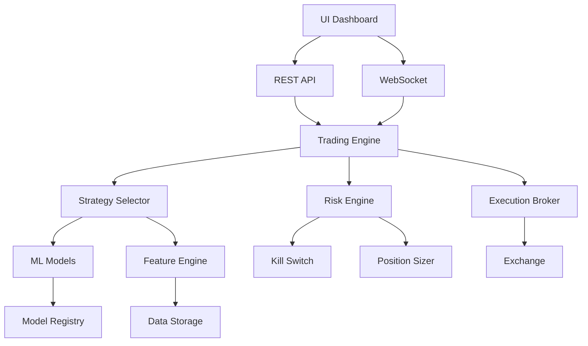

# CryptoBoss Trading System

<div align="center">


**Systematic Crypto Trading Framework**

</div>

---

## ⚠️ IMPORTANT WARNINGS

> **This is NOT a get-rich-quick bot**  
> **This is NOT ready for live trading without extensive paper testing**  
> **You can lose ALL your capital**

**Before considering live trading:**
- [ ] Test in paper mode for AT LEAST 3-6 months
- [ ] Understand every strategy completely
- [ ] Only risk capital you can afford to lose 100%
- [ ] Verify all risk parameters
- [ ] Start with minimal position sizes

---

## What This Actually Is

A **systematic trading framework** for cryptocurrency markets built with:
- Research-grade backtesting
- Walk-forward ML validation
- Production-safe execution
- Risk-first design

**Current Status:** Beta - Paper trading proven

---

## Architecture

```
cryptoboss/
├── src/
│   ├── backtest/          # Real backtesting engine
│   ├── data/              # Feature engineering (30+ features)
│   ├── models/            # ML pipeline + model registry
│   ├── risk/              # Volatility sizing + kill-switch
│   ├── execution/         # Live broker (idempotent orders)
│   ├── strategies/        # Regime-based strategies
│   ├── exchange/          # Exchange abstraction
│   └── api/               # REST + WebSocket API
├── frontend/              # Professional React dashboard
├── core/                  # Legacy modules (being deprecated)
└── dashboard/             # Old dashboard (deprecated)
```

---

## Actual Features Implemented

### ✅ Backtesting (Phase 2)
- Realistic fees (0.02% maker / 0.04% taker)
- Adaptive slippage modeling
- Sharpe, Sortino, max drawdown
- No look-ahead bias

### ✅ Feature Engineering (Phase 3)
- 30+ systematic features
- Returns, volatility, momentum, volume
- Parquet storage (train/live consistency)
- Feature verification system

### ✅ ML Validation (Phase 4)
- Walk-forward validation (no data leakage)
- Model versioning & registry
- Feature importance tracking
- Temporal splits only

### ✅ Risk Management (Phase 5)
- Volatility-adjusted position sizing
- Kill-switch (4 halt conditions)
- Daily/weekly loss limits
- Emergency halt system

### ✅ Live Execution (Phase 6)
- Idempotent order placement
- Position reconciliation
- Retry logic with backoff
- Crash-safe state recovery

### ✅ Strategy Selection (Phase 7)
- Regime detection (4 types)
- Adaptive strategy switching
- Performance tracking

### ✅ Professional UI (Phase 1)
- React/Next.js dashboard
- Real-time charts (Recharts)
- Position management
- Risk metrics display
- Paper/Live mode switch (with warnings)

---

## Quick Start

### 1. Install Dependencies

**Backend:**
```bash
pip install -r requirements.txt
```

**Frontend:**
```bash
cd frontend
npm install
```

### 2. Configure

Create `.env`:
```bash
# Paper trading (safe)
TRADING_MODE=paper
INITIAL_CAPITAL=10000

# For live trading (NOT RECOMMENDED without testing)
# BINANCE_API_KEY=your_key
# BINANCE_API_SECRET=your_secret
```

### 3. Run

**Backend:**
```bash
python -m src.api.routes
# API: http://localhost:8000
```

**Frontend:**
```bash
cd frontend
npm run dev
# UI: http://localhost:3000
```

---

## System Level

**Current:** 7+/10 (Advanced systematic system)  
**Target:** 9/10 (Production-ready)

### What Works
- ✅ Real backtesting
- ✅ Systematic ML validation
- ✅ Risk management
- ✅ Paper trading
- ✅ Professional UI

### What Doesn't (Yet)
- ❌ Live trading (needs months of paper testing first)
- ❌ Multi-exchange support (only Binance)
- ❌ Comprehensive test coverage (<50%)
- ❌ Production deployment guides

---

## Testing

```bash
# Run backend tests
pytest tests/ -v

# Type checking
mypy src/

# Frontend tests
cd frontend && npm test
```

---

## Risk Disclaimer

**READ THIS CAREFULLY:**

1. **No Guarantees**: Past performance means nothing
2. **High Risk**: Crypto is volatile - expect 50%+ drawdowns
3. **No Liability**: Use at your own risk
4. **Not Financial Advice**: This is educational only
5. **Can Lose Everything**: Only trade with money you can lose

**Paper trade for 3-6 months minimum before considering live capital.**

---

## Roadmap

### Short Term
- [x] Advanced backtesting
- [x] ML validation framework
- [x] Professional UI
- [ ] 80%+ test coverage
- [ ] Production deployment guide

### Medium Term
- [ ] 6 months paper trading proof
- [ ] Multi-exchange support
- [ ] Advanced portfolio management
- [ ] Real-time model retraining

### Long Term
- [ ] Live trading (after extensive validation)
- [ ] Cloud deployment
- [ ] Multi-asset portfolio
- [ ] Advanced ML models

---

## Architecture Diagram



---

## Contributing

This is a personal trading system. Not accepting contributions at this time.

---

## License

MIT License - Use at your own risk

---

## Acknowledgments

Built following professional quant trading practices, not hype.

**Remember: Trading is hard. Most traders lose money. This system doesn't change that.**