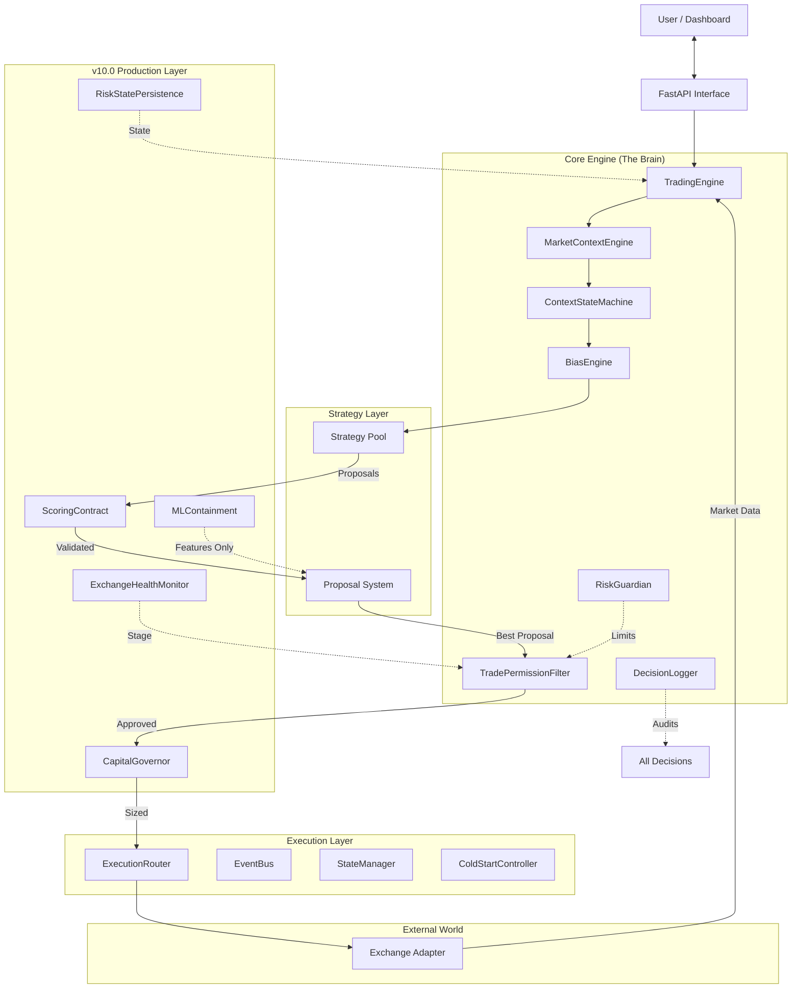
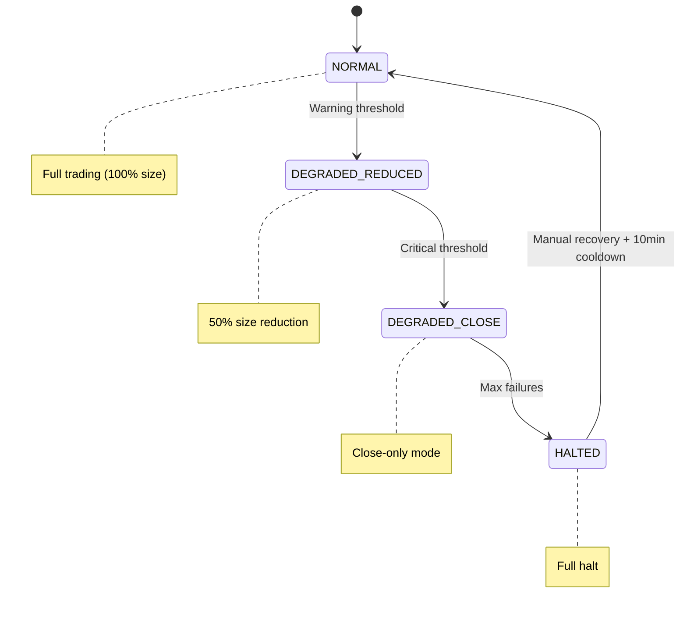

# 🏗️ CryptoBoss Architecture Analysis (v10.0)

## System Overview

CryptoBoss is a **production-grade, discretionary trading bot** designed for reliability, explainability, and risk management. Unlike simple signal-following bots, it employs a sophisticated "Context-First" decision engine that mimics human professional traders.

**Architecture Version**: 10.0/10 (Production-Grade)  
**Primary Language**: Python 3.9+  
**Interface**: React/Next.js (Frontend) + FastAPI (Backend)

---

## 1. High-Level Architecture Diagram



---

## 2. Directory Structure & Key Components

```
d:/projects/final99/
├── src/
│   ├── api/                     # REST & WebSocket Endpoints
│   │   └── routes.py            # Dashboard API interface
│   ├── core/                    # Core Business Logic (28 modules)
│   │   ├── engine.py            # Main orchestration loop
│   │   ├── market_context_engine.py   # Market regime analysis
│   │   ├── context_state_machine.py   # v9.5: Finite state machine
│   │   ├── bias_engine.py       # Directional conviction logic
│   │   ├── trade_permission_filter.py # v10.0: Proposal-aware
│   │   ├── scoring_contract.py  # v10.0: 4-component validation
│   │   ├── ml_containment.py    # v10.0: Feature-only ML
│   │   ├── capital_governor.py  # v10.0: Dynamic allocation
│   │   ├── exchange_health_monitor.py # v10.0: 4-stage escalation
│   │   ├── risk_state_persistence.py  # v9.5: Survives restarts
│   │   ├── cold_start_controller.py   # v9.5: Safe warm-up
│   │   ├── replay_engine.py     # v9.5: Deterministic replay
│   │   ├── decision_logger.py   # Audit trail system
│   │   ├── risk_guardian.py     # Risk management & limits
│   │   └── execution_router.py  # Paper/Live execution routing
│   ├── strategies/              # Trading Logic
│   ├── exchange/                # External Connectivity
│   └── analysis/                # Data Processing
├── frontend/                    # User Interface (Next.js)
└── tests/                       # Integration & Unit Tests
```

---

## 3. Core Architectural Layers

### A. The Decision Layer (v10.0 Production)

The decision hierarchy enforces strict gating:

| Step | Component | Question |
|------|-----------|----------|
| 1 | **Market Context** | Is the market safe to trade? |
| 2 | **State Machine** | Is transition valid? (min 2h duration) |
| 3 | **Bias** | What is the higher timeframe saying? |
| 4 | **Scoring Contract** | Does proposal have all 4 components? |
| 5 | **Permission** | Is direction/size/exposure valid? |
| 6 | **Capital Governor** | How much capital is allocated? |
| 7 | **Health Check** | Is exchange healthy? |

### B. The v10.0 Production Layer

| Component | Purpose |
|-----------|---------|
| **ScoringContract** | Validates 4 mandatory score components |
| **MLContainment** | Ensures ML = features only, not proposals |
| **CapitalGovernor** | Context-based dynamic allocation |
| **ExchangeHealthMonitor** | 4-stage graduated escalation |
| **RiskStatePersistence** | Survives restarts with checksum validation |

### C. The Strategy Layer

Strategies are **Signal Generators** wrapped in **Proposal Adapters**:

```python
# Old Way (Rejected)
generate_signal() -> BUY/SELL

# New Way (Required)
propose_entry(context, bias) -> ContractValidatedProposal(
    context_fit=0.85,
    historical_expectancy=0.70,
    recent_performance_decay=0.90,
    risk_alignment=0.75,
    ...
)
```

### D. The Execution Layer

| Component | Role |
|-----------|------|
| **ExecutionRouter** | Routes to LiveBroker vs PaperBroker |
| **ColdStartController** | 5-min warm-up, data sync, stability |
| **ReplayEngine** | Deterministic record/playback |

### E. The Safety Layer

Multi-layered protection:

| Layer | Protection |
|-------|------------|
| **RiskGuardian** | Portfolio limits, position sizing |
| **BudgetManager** | 10 trades/day, 3/context, 2 losses/bias |
| **HealthEscalation** | NORMAL → DEGRADED → HALTED |
| **KillSwitch** | Emergency stop (persists across restarts) |

---

## 4. v10.0 Escalation Stages



---

## 5. Scoring Contract (v10.0)

All proposals must include 4 mandatory components:

| Component | Weight | Description |
|-----------|--------|-------------|
| `context_fit` | 30% | How well proposal fits current regime |
| `historical_expectancy` | 25% | Strategy's track record |
| `recent_performance_decay` | 25% | Recent win/loss impact |
| `risk_alignment` | 20% | Alignment with risk limits |

**Unnormalized proposals are REJECTED.**

---

## 6. ML Containment Rules

- ✅ ML outputs = **Features Only**
- ❌ ML cannot generate `EntryProposal`
- ✅ Blocked patterns: `entry_signal`, `buy_signal`, `sell_signal`
- ✅ Max ML influence: 30% per decision
- ✅ All ML usage explicitly logged

---

## 7. Capital Allocation Table

| Context | Base Allocation | Notes |
|---------|----------------|-------|
| `trending_up` | 100% | Full capital available |
| `trending_down` | 100% | Full capital available |
| `ranging` | 75% | Reduced for chop |
| `high_volatility` | 30% | Aggressive reduction |
| `no_trade` | 0% | Trading blocked |

**Modifiers**: Volatility, Drawdown, Exchange Health

---

## 8. Technical Stack

| Category | Technology |
|----------|------------|
| **Runtime** | Python 3.9+ |
| **Web Server** | FastAPI (async) |
| **UI Framework** | Next.js / React / TailwindCSS |
| **Data Models** | Pydantic & Dataclasses |
| **Persistence** | SQLite + JSONL + JSON (atomicwrites) |
| **Exchange** | ccxt / Direct API clients |

---

## 9. Non-Negotiable Constraints

| Constraint | Enforced By |
|------------|-------------|
| No direct strategy execution | ProposalScorer + Permission |
| Bias cannot be bypassed | BiasEngine hard gate |
| Risk overrides all modules | RiskGuardian veto |
| Paper/Live logic identical | ExecutionRouter abstraction |
| Every decision logged | DecisionLogger audit trail |

---

## 10. Maturity Assessment

| Metric | Score | Notes |
|--------|-------|-------|
| **Architecture Quality** | **10.0 / 10** | Production-Grade |
| **Test Coverage** | High | Core logic + integration |
| **Scalability** | Very High | Modular, swappable |
| **Safety** | Maximum | 7-layer protection |
| **Explainability** | Complete | All decisions logged |

---

## 11. Evolution History

| Version | Level | Key Features |
|---------|-------|--------------|
| Initial | 5.0 | Basic signal following |
| Phase 3 | 7.5 | Context, Bias, Permission |
| Phase 5 | 9.0 | Proposals, Testing |
| Phase 6 | 9.5 | State Machine, Persistence, Cold Start |
| **Phase 7** | **10.0** | Scoring Contract, ML Containment, Capital Governor |

---

*Built for survival, consistency, and explainability over trade frequency.*
