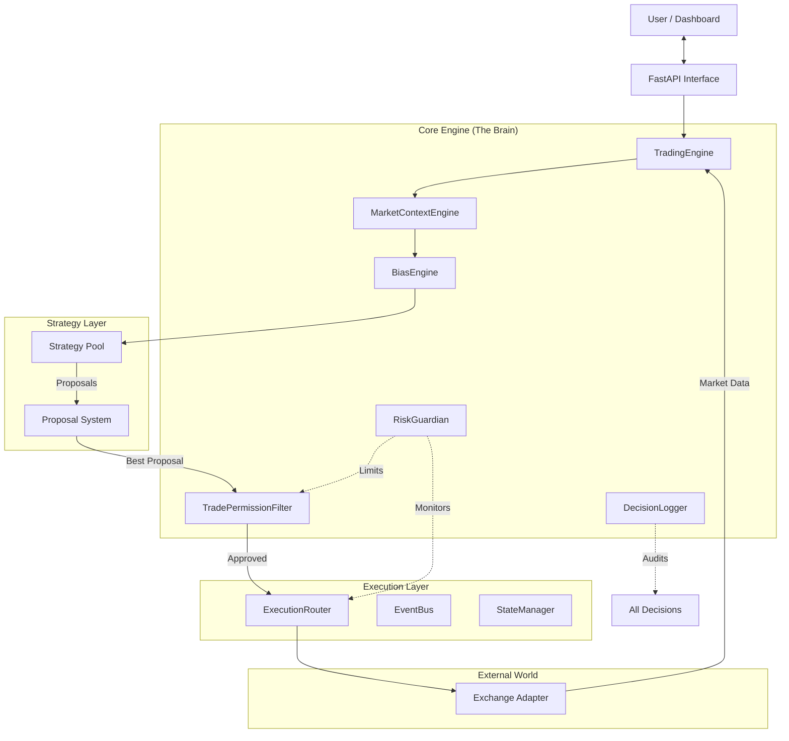

# 🏗️ CryptoBoss Architecture Analysis (v9.0)

## System Overview

CryptoBoss is a professional-grade, discretionary trading bot architecture designed for reliability, explainability, and risk management. Unlike simple signal-following bots, it employs a sophisticated "Context-First" decision engine that mimics human professional traders.

**Architecture Style**: Modular, Event-Driven, Component-Based
**Primary Language**: Python 3.9+
**Interface**: React/Next.js (Frontend) + FastAPI (Backend)

---

## 1. High-Level Architecture Diagram



---

## 2. Directory Structure & Key Components

```
d:/projects/final99/
├── src/
│   ├── api/                 # REST & WebSocket Endpoints
│   │   └── routes.py        # Dashboard API interface
│   ├── core/                # Core Business Logic
│   │   ├── engine.py        # Main orchestration loop
│   │   ├── market_context_engine.py  # Market regime analysis
│   │   ├── bias_engine.py   # Directional conviction logic
│   │   ├── decision_logger.py # Audit trail system
│   │   ├── risk_guardian.py # Risk management & limits
│   │   └── execution_router.py # Paper/Live execution routing
│   ├── strategies/          # Trading Logic
│   │   ├── dca_strategy.py  # Dollar Cost Averaging impl
│   │   └── ...              # Other strategies
│   ├── exchange/            # External Connectivity
│   │   └── base.py          # Exchange abstraction layer
│   └── analysis/            # Data Processing
├── frontend/                # User Interface (Next.js)
├── dashboard/               # Legacy dashboard components
└── tests/                   # Integration & Unit Tests
```

---

## 3. Core Architectural Layers

### A. The Decision Layer (Professional Upgrade)
This is the differentiating factor of CryptoBoss v9.0. It enforces a strict decision hierarchy:
1.  **Market Context**: "Is the market safe to trade?" (e.g., Avoid High Volatility, Low Liquidity).
2.  **Bias**: "What is the higher timeframe saying?" (Long/Short/Neutral).
3.  **Proposal**: Strategies don't execute; they *propose* entries with confidence scores.
4.  **Permission**: A final gatekeeper checks spread, time-of-day, and daily drawdowns.

### B. The Strategy Layer
Strategies are essentially **Signal Generators** wrapped in a **Proposal Adapter**.
*   **Old Way**: `generate_signal()` -> `BUY/SELL`.
*   **New Way**: `propose_entry(context, bias)` -> `EntryProposal(confidence=0.85, reasoning="...")`.

### C. The Execution Layer
Decouples *intent* from *action*.
*   **ExecutionRouter**: Takes an `OrderIntent` and routes it to either `LiveBroker` or `PaperBroker`.
*   **ExchangeInterface**: Abstracts specific exchange APIs (Binance, Bybit) into a common interface (`get_ticker`, `place_order`).

### D. The Safety Layer
Risk management is not an afterthought; it runs parallel to execution.
*   **RiskGuardian**: Tracks portfolio-level risk (e.g., Max Daily Drawdown, Position sizing limits).
*   **KillSwitch**: Emergency stop functionality accessible via API.

---

## 4. Data Flow & Event Model

The system uses a hybrid **Poll + Event** model.
1.  **Polling**: The `TradingEngine` loop polls the Exchange for price updates (`_process_price_update`).
2.  **Events**: Significant state changes (Order Filled, Risk Breach) are emitted to the `EventBus`.
    *   `src/core/event_bus.py` handles pub/sub.
    *   Dashboard listens to these events via WebSockets (`src/api/routes.py`).

---

## 5. Interface & Control Plane

The functionality is exposed via a REST/WebSocket API (`src/api/routes.py`).
*   **Command Control**: Enable/Disable strategies, Switch Modes (Paper/Live).
*   **Monitoring**: Real-time prices, logs, and position updates via WebSockets.
*   **Frontend**: A Next.js application consumes this API to provide the user dashboard.

---

## 6. Technical Stack

*   **Runtime**: Python 3.9+
*   **Web Server**: FastAPI (High performance async framework)
*   **UI Framework**: Next.js / React / TailwindCSS
*   **Data Models**: Pydantic & Python Dataclasses
*   **Persistence**: SQLite (via `SQLiteManager`) + JSONL (Decision Logs)
*   **Exchange Connectivity**: `ccxt` (likely used within specific implementations) or direct API clients.

---

## 7. Critical Implementation Details

*   **Singleton Pattern**: Key engines (`MarketContext`, `Bias`, `Risk`) operate as singletons to maintain global state consistency.
*   **Immutability**: Decision logs are append-only to ensure a tamper-proof audit trail.
*   **Graceful Shutdown**: Dedicated logic ensures open positions and state are saved before the process terminates.

## 8. Maturity Assessment

*   **Architecture Quality**: **9.0 / 10** (Professional Discretionary)
*   **Test Coverage**: Moderate to High (Core logic covered)
*   **Scalability**: High (Modular design allows swapping exchanges or strategies easily)
*   **Safety**: Very High (Multi-layered risk gates)
